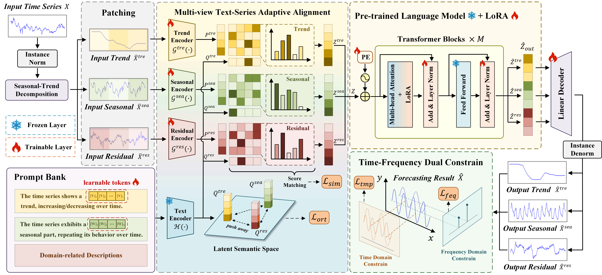

<div align="center">
  <h1><b>PRADA: Prompt-guided Representation Alignment and Dynamic Adaption for Time Series Forecasting </b></h1>
</div>

<div align="center">
  <a href="https://github.com/HowardLiu28">Yinhao Liu</a><sup>1</sup>, <a href="https://github.com/KZYYYY">Zhenyu Kuang</a><sup>2</sup>, <a href="https://github.com/HRT00">Hongyang Zhang</a><sup>3</sup>, <a href="https://github.com/lichen0620">Chen Li</a><sup>3</sup>, Feifei Li<sup>3</sup>, Xinghao Ding<sup>3</sup>
</div>

<div align="center">
  <sup>1</sup> Institute of Artificial Intelligence, Xiamen University         <sup>2</sup> School of Electronic and Information Engineering, Foshan University 
  
  <sup>3</sup> School of Informatics, Xiamen University
</div>

---
>
> 🙋 Please let us know if you find out a mistake or have any suggestions!
> 
> 🙏 If you find this resource helpful, please consider to star this repository and cite our research:

```
@article{liu2025prada,
  title={PRADA: Prompt-guided Representation Alignment and Dynamic Adaption for time series forecasting},
  author={Liu, Yinhao and Kuang, Zhenyu and Zhang, Hongyang and Li, Chen and Li, Feifei and Ding, Xinghao},
  journal={Knowledge-Based Systems},
  pages={113478},
  year={2025},
  publisher={Elsevier}
}
```

## 🏆 Updates/News:

🚩 **News** (April.1 2025): PRADA has been accpeted by Knowledge-Based Systems, 2025.

🚩 **News** (April.22 2025): The paper is availble at <a href="https://www.sciencedirect.com/science/article/abs/pii/S0950705125005246">here</a>.

🚩 **News** (April.27 2025): The code is now released.

## 📰 Introduction:

PRADA is a novel framework for time series forecasting based on LLMs. It decomposes time series into trend, seasonal, and residual terms, designs learnable textual prompts aligned with each component by the multi-view TSAA, which further mitigates the gap between natural language and time series. Additionally, a Time-Frequency Dual Constraint is applied to capture overlooked label autocorrelations.
<p align="center">

</p>

## 🤗 Basic Preparation:

**Datasets:** You can access the well pre-processed datasets from [[Google Drive]](https://drive.google.com/file/d/1NF7VEefXCmXuWNbnNe858WvQAkJ_7wuP/view?usp=sharing) or [[Baidu Drive]](https://pan.baidu.com/s/1r3KhGd0Q9PJIUZdfEYoymg?pwd=i9iy), then place the downloaded contents under `./all_datasets`.

**Pretrained GTP-2:** We use the pre-trained GPT-2 as our backbone network. You can download its weight from [here](https://huggingface.co/openai-community/gpt2/tree/main) and place it under `./gpt2`.

## 🛠️ Requirements and Installation:

Ensure your environment meets the following requirements under python 3.11.0:

- einops==0.8.1
- joblib==1.4.2
- matplotlib==3.10.1
- numpy==1.23.5
- pandas==2.2.3
- peft==0.13.2
- scikit_learn==1.6.1
- statsmodels==0.14.4
- torch==2.1.0
- torchprofile==0.0.4
- tqdm==4.66.5
- transformers==4.45.2
- xlrd==2.0.1

For convenience, you can run:
```bash
conda create -n prada python=3.11.0 -y
conda activate prada
pip install -r requirements.txt
```

## 🚀 Getting Started:

**Long-term forecasting:** We provide all experimental scripts for 8 different benchmarks including ETTh1, ETTh2, ETTm1, ETTm2, Traffic, Weather, Electricity, and ILI for long-term forecasting task. The forecasting horizon is set to {24, 36, 48, 60} for ILI and {96, 192, 336, 720} for the others. For example, you can evaluate the model by:
```bash
# ETTh1
bash ./scripts/long_term_forecast/ETT_script/PRADA_ETTh1.sh
# Traffic
bash ./scripts/long_term_forecast/Traffic_script/PRADA.sh
# Weather
bash ./scripts/long_term_forecast/Weather_script/PRADA.sh
# Electricity
bash ./scripts/long_term_forecast/ECL_script/PRADA.sh
# ILI
bash ./scripts/long_term_forecast/ECL_script/ILI.sh
```

**Short-term forecasting:** We evaluate our model on M4 dataset for short-term forecasting task. The forecasting horizon is set to {6, 48} under different sampling intervals, including Yearly, Quarterly, Monthly, Weekly, Daily, and Hourly. You can run:
```bash
# M4
bash ./scripts/short_term_forecast/PRADA_M4.sh
```
**Few-shot forecasting:** You can set the parameter `--percent` to evaluate the model's few-shot forecasting performance. For example, for the few-shot task on 10% training data setting, you can set `--percent 5 \` in your experimental script (only for long-term forecasting task).

**Zero-shot forecasting:** You can use the `run_zsl.py` file to evaluate the zero-shot performance of the model on ETT benchmark. For example, you can run the following code to evaluate the generalization in the ETTh1-ETTh2 setting:
```bash
python run_zsl.py --model_id ETTh1-ETTh2_512_96 --src_data ETTh1 --src_data_path ETTh1.csv --tgt_data ETTh2 --tgt_data_path ETTh2.csv --number_variable 7
```

## 📈 Train and Forecast:
- The model file is stored in `./models/PRADA.py`, and the text prompt template is stored in `./models/prompt.py`. You can imitate the content and modify it and register the model in `./exp/exp_basic.py`.
- The domain description prompts for different benchmarks are stored in folder `./prompt_bank` and support custom modification.

## 🌟 Acknowledgement:
Our implementation adapts [Time-Series-Library](https://github.com/thuml/Time-Series-Library), [OFA (GPT4TS)](https://github.com/DAMO-DI-ML/NeurIPS2023-One-Fits-All), and [Time-LLM](https://github.com/KimMeen/Time-LLM) as the code base and have extensively modified it to our purposes. We thank the authors for sharing their implementations and related resources.

```
@inproceedings{wu2023timesnet,
  title={TimesNet: Temporal 2D-Variation Modeling for General Time Series Analysis},
  author={Haixu Wu and Tengge Hu and Yong Liu and Hang Zhou and Jianmin Wang and Mingsheng Long},
  booktitle={International Conference on Learning Representations},
  year={2023},
}
```
```
@article{wang2024tssurvey,
  title={Deep Time Series Models: A Comprehensive Survey and Benchmark},
  author={Yuxuan Wang and Haixu Wu and Jiaxiang Dong and Yong Liu and Mingsheng Long and Jianmin Wang},
  booktitle={arXiv preprint arXiv:2407.13278},
  year={2024},
}
```
```
@inproceedings{zhou2023onefitsall,
  title={{One Fits All}: Power General Time Series Analysis by Pretrained LM},
  author={Tian Zhou, Peisong Niu, Xue Wang, Liang Sun, Rong Jin},
  booktitle={NeurIPS},
  year={2023}
}
```
```
@inproceedings{jin2023time,
  title={{Time-LLM}: Time series forecasting by reprogramming large language models},
  author={Jin, Ming and Wang, Shiyu and Ma, Lintao and Chu, Zhixuan and Zhang, James Y and Shi, Xiaoming and Chen, Pin-Yu and Liang, Yuxuan and Li, Yuan-Fang and Pan, Shirui and Wen, Qingsong},
  booktitle={International Conference on Learning Representations (ICLR)},
  year={2024}
}
```
